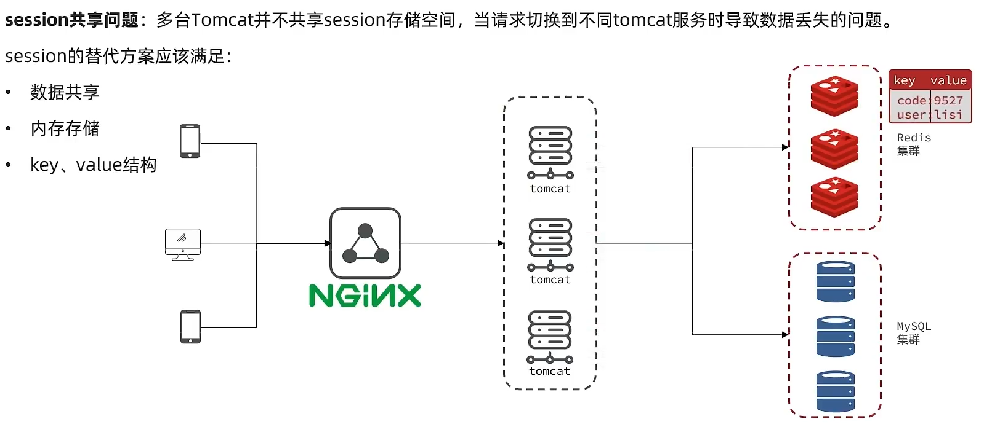

# 基础篇

## 认识缓存

缓存：一种具有高效读写能力的数据暂存区域

## 缓存的作用

1. 降低后端的负载
2. 提高服务的读写响应速度

## 缓存的成本

- 开发成本
- 运维成本
- 数据一致性

### 短信验证码-实战

基于session的短信验证码登录，**每个session保存在请求对应的tomcat服务器上**，若在tomcat集群环境下则无法保证每次请求到同一个tomcat服务器上，即**无法保证session数据共享**。我们能如何解决这个问题呢？

早期的方案是**session拷贝**，就是说虽然每个tomcat上都有不同的session，但是每当任意一台服务器的session修改时，都会同步给其他的Tomcat服务器的session，这样的话，就可以实现session的共享了。

但是这种方案具有两个大**问题**

1. <Badge text="每台服务器中都有完整的一份session数据，服务器压力过大。" type="warning" vertical="middle" />

2. <Badge text="session拷贝数据时，可能会出现延迟" type="warning" vertical="middle" />

所以咱们后来采用的方案都是==基于redis来完成==，我们把session换成redis，redis数据本身就是共享的，就可以避免session共享的问题了



## 缓存更新策略

1. 内存淘汰：Redis自带的内存淘汰机制
2. 过期淘汰：利用expire命令给数据设置过期时间
3. 主动更新：主动完成数据库与缓存的同时更新

<Badge text="策略选择" type="tip" vertical="middle" />
- 低一致性需求：选择内存淘汰或者过期淘汰策略
- 高一致性需求：选择主动更新 + 过期时间兜底

## 主动更新的方案
- Cache Aside：缓存调用者在更新数据库的同时完成对缓存的更新。 <Badge text="一致性良好" type="tip" vertical="middle" /> <Badge text="实现难度一般" type="tip" vertical="middle" />

- Read/Write Through：缓存与数据库集成一个服务，服务保证两者的一致性，对外暴露API调用接口。调用者调用API，无需知道自己操作的是数据库还是缓存，不关心一致性。 <Badge text="一致性优秀" type="tip" vertical="middle" /> <Badge text="实现复杂" type="tip" vertical="middle" /> <Badge text="性能一般" type="tip" vertical="middle" />

- Write Back：缓存调用者的CRUD都针对缓存完成。由独立线程异步的将缓存数据写到数据库，实现最终一致性 <Badge text="一致性差" type="tip" vertical="middle" /> <Badge text="实现复杂" type="tip" vertical="middle" /> <Badge text="性能好" type="tip" vertical="middle" />

> 使用 ==Cache Aside== 方案，先操作数据库还是先操作缓存
> 
> * 删除缓存还是更新缓存？
>   * 更新缓存：每次更新数据库都更新缓存，无效写操作较多
>   * 删除缓存：更新数据库时让缓存失效，查询时再更新缓存
>
> * 如何保证缓存与数据库的操作的同时成功或失败？
>   * 单体系统，将缓存与数据库操作放在一个事务
>   * 分布式系统，利用TCC等分布式事务方案
>
> 先操作缓存还是先操作数据库？
>   - 先删除缓存，再操作数据库：在满足原子性的情况下，安全问题概率较低
>   - 先操作数据库，再删除缓存：安全问题概率较高

<Badge text="最佳实践" type="note" vertical="middle" />

::: normal-demo 查询数据时
```java
  // 根据key查询redis，是否命中
  String shopJson = stringRedisTemplate.opsForValue().get("cacheKey");

  if (StrUtil.isNotBlank(shopJson)) {
    // redis命中，json转为obj返回
    return JSONUtil.toBean(shopJson, Object.class);
  }

  // redis未命中，查询db
  Object object = getById(id);

  // db未命中，返回失败
  if (object == null) {
      // 未命中缓存空对象
      stringRedisTemplate.opsForValue().set("cacheKey", "");
      // 返回空对象
      return null;
  }
  // db命中，存入redis，成功返回
  stringRedisTemplate.opsForValue().set("cacheKey", JSONUtil.toJsonStr(object));
  // 返回查询结果
  return object;
```
:::

```flow
st=>start: 开始
e=>end: 结束
op1=>operation: 查询缓存
op2=>operation: 返回结果
op3=>operation: 查询数据库
op4=>operation: 将数据库数据写入缓存
cond=>condition: 判断缓存是否命中？

st->op1->cond
cond(no)->op2
cond(yes, right)->op3->op4(left)->op2
op2->e
```

::: normal-demo 修改数据库时
```java
  // 更新数据库
  updateById(shop);
  
  // 删除redis缓存
  stringRedisTemplate.delete("cacheKey");
  
  return ;
```
:::

```flow
st=>start: 开始
e=>end: 结束
op1=>operation: 修改数据库
op2=>operation: 删除缓存
op3=>operation: 确保两者原子性

st->op1->op2->op3->e
```

## 缓存穿透

产生原因：客户端请求的数据在缓存中和数据库中都不存在，这样缓存永远不会生效，这些请求都会打到数据库

常见的解决方案有两种：

- 缓存空对象
  - 思路：对于不存在的数据也**在Redis建立缓存，值为空**，并设置一个**较短的TTL时间**。
  - 优点：<Badge text="实现简单" type="tip" vertical="middle" /> <Badge text="维护方便" type="tip" vertical="middle" />
  - 缺点：<Badge text="额外的内存消耗" type="danger" vertical="middle" /> <Badge text="可能造成短期的不一致" type="danger" vertical="middle" />

- 布隆过滤
  - 思路：利用**布隆过滤器算法**，在请求**进入Redis之前先判断是否存在**，如果不存在则直接拒绝请求。
  - 优点：<Badge text="内存占用较少" type="tip" vertical="middle" /> <Badge text="没有多余key" type="tip" vertical="middle" />
  - 缺点：<Badge text="实现复杂" type="danger" vertical="middle" /> <Badge text="存在误判可能" type="danger" vertical="middle" />

- 其他
  - 做好数据的基础格式校验
  - 加强用户权限校验
  - 做好热点参数的限流

## 缓存雪崩

缓存雪崩是指在同一时段大量的缓存key同时失效或者Redis服务宕机，导致大量请求到达数据库，带来巨大压力。


解决方案：
  - 给不同的Key的TTL添加随机值
  - 利用Redis集群提高服务的可用性
  - 给缓存业务添加降级限流策略
  - 给业务添加多级缓存

## 缓存击穿（热点key）问题

热点key：在**某一时间段**会被****高并发访问**，缓存重建**耗时较长**

缓存击穿问题也叫热点Key问题，就是一个被高并发访问并且缓存重建业务较复杂的key突然失效了，无数的请求访问会在瞬间给数据库带来巨大的冲击。

------

> 逻辑分析：假设线程1在查询缓存之后，本来应该去查询数据库，然后把这个数据重新加载到缓存的，此时只要线程1走完这个逻辑，其他线程就都能从缓存中加载这些数据了，但是**假设在线程1没有走完**的时候，**后续的线程**2，线程3，线程4**同时**过来**访问**当前这个方法， 那么这些线程都不能从缓存中查询到数据，那么他们就会同一时刻来访问查询缓存，都没查到，接着**同一时间去访问数据库**，同时的去执行数据库代码，对**数据库访问压力过大**


------

解决方案

1. 互斥锁：
  - 思路：给缓存重建过程加锁，确保重建过程只有一个线程执行，其他线程等待。
  - 优点：<Badge text="实现简单" type="tip" vertical="middle" /> <Badge text="无额外内存消耗" type="tip" vertical="middle" /> <Badge text="一致性较好" type="tip" vertical="middle" />
  - 缺点：<Badge text="线程等待导致性能下降" type="danger" vertical="middle" /> <Badge text="存在死锁风险" type="danger" vertical="middle" />

> 实战篇中，通过redis的setnx来判断是否有线程进行数据重建

2. 逻辑过期：
  - 思路：
    - 热点key缓存永不过期，而是设置一个逻辑过期时间，查询到数据时通过对逻辑时间判断，来决定是否需要重建数据。
    - 重建缓存也是通过互斥锁保证单线程执行。
    - 重建缓存使用独立线程异步执行。
    - 其他线程无需等待，直接查询旧数据返回即可。
  - 优点：<Badge text="线程无需等待，性能较好" type="tip" vertical="middle" />
  - 缺点：<Badge text="不保证线程一致性" type="danger" vertical="middle" /> <Badge text="有额外内存损耗" type="danger" vertical="middle" /> <Badge text="实现复杂" type="danger" vertical="middle" />

## 缓存工具类

::: normal-demo 示例
```java
package com.*.*;

import cn.hutool.core.util.BooleanUtil;
import cn.hutool.core.util.StrUtil;
import cn.hutool.json.JSONObject;
import cn.hutool.json.JSONUtil;
import lombok.extern.slf4j.Slf4j;
import org.springframework.data.redis.core.StringRedisTemplate;
import org.springframework.stereotype.Component;

import java.time.LocalDateTime;
import java.util.concurrent.ScheduledThreadPoolExecutor;
import java.util.concurrent.TimeUnit;
import java.util.function.Function;


/**
 * @Author 帅博文
 * @Date 2023/11/23 17:03
 * @Version 1.0
 */
@Component
@Slf4j
public class CacheClient {
    private final StringRedisTemplate stringRedisTemplate;

    private static final ScheduledThreadPoolExecutor CACHE_REBUILD_POOL;

    public CacheClient(StringRedisTemplate stringRedisTemplate) {
        this.stringRedisTemplate = stringRedisTemplate;
    }

    static {
        int corePoolSize = 10;
        int maximumPoolSize = 10;
        long keepAliveTime = 60L;
        TimeUnit unit = TimeUnit.SECONDS;

        CACHE_REBUILD_POOL = new ScheduledThreadPoolExecutor(10);
        CACHE_REBUILD_POOL.setMaximumPoolSize(maximumPoolSize);
        CACHE_REBUILD_POOL.setKeepAliveTime(keepAliveTime, unit);
    }


    /**
     * 存入redis，带有ttl
     *
     * @param key
     * @param value
     * @param expireTime
     * @param unit
     */
    public void set(String key, Object value, Long expireTime, TimeUnit unit) {
        stringRedisTemplate.opsForValue().set(key, JSONUtil.toJsonStr(value), expireTime, unit);
    }

    /**
     * 存入reids，带有逻辑过期时间
     *
     * @param key
     * @param value
     * @param expireTime
     * @param unit
     */
    public void setWithLogicalExpire(String key, Object value, Long expireTime, TimeUnit unit) {
        RedisData redisData = new RedisData();
        redisData.setData(value);
        redisData.setExpireTime(LocalDateTime.now().plusSeconds(unit.toSeconds(expireTime)));
        stringRedisTemplate.opsForValue().set(key, JSONUtil.toJsonStr(redisData));
    }


    /**
     * 获取redis数据，未命中时返回空对象
     * 避免缓存穿透
     *
     * @param keyPrefix
     * @param id
     * @param type
     * @param dbFallBack
     * @param expireTime
     * @param unit
     * @param <R>
     * @param <ID>
     * @return
     */
    public <R, ID> R queryWithPassThrough(
            String keyPrefix, ID id, Class<R> type, Function<ID, R> dbFallBack,
            Long expireTime, TimeUnit unit) {
        String key = keyPrefix + id;
        String json = stringRedisTemplate.opsForValue().get(key);

        // 命中redis，且不为空
        if (StrUtil.isNotBlank(json)) {
            return JSONUtil.toBean(json, type);
        }
        // 命中为空时
        if (json != null) {
            return null;
        }

        R r = dbFallBack.apply(id);
        // 查询db，不存在，缓存空对象
        if (r == null) {
            stringRedisTemplate.opsForValue().set(key, "", expireTime, unit);
            return null;
        }

        // 存在，数据重建
        stringRedisTemplate.opsForValue().set(key, JSONUtil.toJsonStr(r), expireTime, unit);
        return r;
    }


    /**
     * 获取redis 热点数据
     * 通过逻辑过期时间，避免缓存击穿问题
     * 前提：热点key会提前放到redis中
     * 默认：认为未命中redis的，不是本次的热点key
     *
     * @param keyPrefix
     * @param id
     * @param type
     * @param dbFallBack
     * @param time       逻辑过期时长
     * @param unit       逻辑过期时间单位
     * @param lockKey
     * @param lockTime   redis锁过期时间
     * @param lockUnit   redis锁过期时间单位
     * @param <R>
     * @param <ID>
     * @return
     */
    public <R, ID> R queryWithLogicalExpire(
            String keyPrefix, ID id, Class<R> type, Function<ID, R> dbFallBack,
            Long time, TimeUnit unit,
            String lockKey, Long lockTime, TimeUnit lockUnit
    ) {
        String key = keyPrefix + id;
        String json = stringRedisTemplate.opsForValue().get(key);

        if (StrUtil.isBlank(json)) {
            return null;
        }

        RedisData redisData = JSONUtil.toBean(json, RedisData.class);
        LocalDateTime expireTime = redisData.getExpireTime();
        R r = JSONUtil.toBean((JSONObject) redisData.getData(), type);

        // 未过期，直接返回
        if (expireTime.isAfter(LocalDateTime.now())) {
            return r;
        }

        // 过期，数据重建
        boolean lock = tryLock(lockKey, lockTime, lockUnit);
        // 获取锁失败，直接返回旧数据
        if (!lock) {
            return r;
        }
        // 获取锁成功，DoubleCheck
        json = stringRedisTemplate.opsForValue().get(key);
        if (StrUtil.isBlank(json)) {
            return null;
        }
        redisData = JSONUtil.toBean(json, RedisData.class);
        expireTime = redisData.getExpireTime();
        r = JSONUtil.toBean((JSONObject) redisData.getData(), type);
        if (expireTime.isAfter(LocalDateTime.now())) {
            return r;
        }

        // 数据重建
        CACHE_REBUILD_POOL.submit(() -> {
            try {
                saveObject2Redis(key, id, time, dbFallBack, unit);
            } catch (InterruptedException e) {
                log.error("saveShop2Redis error: ", e);
                throw new RuntimeException(e);
            } finally {
                unLock(lockKey);
            }

        });
        return null;
    }

    /**
     * 保存对象到redis中，并设置逻辑过期时间
     *
     * @param key
     * @param id
     * @param expireSeconds
     * @param dbFallBack
     * @param unit
     * @param <ID>
     * @param <R>
     * @throws InterruptedException
     */
    private <ID, R> void saveObject2Redis(
            String key, ID id, Long expireSeconds,
            Function<ID, R> dbFallBack, TimeUnit unit) throws InterruptedException {
        // 查询数据库
        R r = dbFallBack.apply(id);
        // 模拟重建数据延迟
        Thread.sleep(200);
        // 创建redisData对象
        RedisData redisData = new RedisData();
        redisData.setData(r);
        redisData.setExpireTime(LocalDateTime.now().plusSeconds(unit.toSeconds(expireSeconds)));
        // 存入redis
        stringRedisTemplate.opsForValue().set(key, JSONUtil.toJsonStr(redisData));
    }

    /**
     * 通过setnx，来限制单线程重建数据
     * 根据lockKey，设置锁过期时间
     *
     * @param lockKey
     * @param expireTime
     * @param unit
     * @return
     */
    private boolean tryLock(String lockKey, Long expireTime, TimeUnit unit) {
        Boolean flag = stringRedisTemplate.opsForValue().setIfAbsent(lockKey, "1", expireTime, unit);
        return BooleanUtil.isTrue(flag);
    }

    /**
     * 释放redis锁
     *
     * @param lockKey
     */
    private void unLock(String lockKey) {
        stringRedisTemplate.delete(lockKey);
    }

}
```
:::